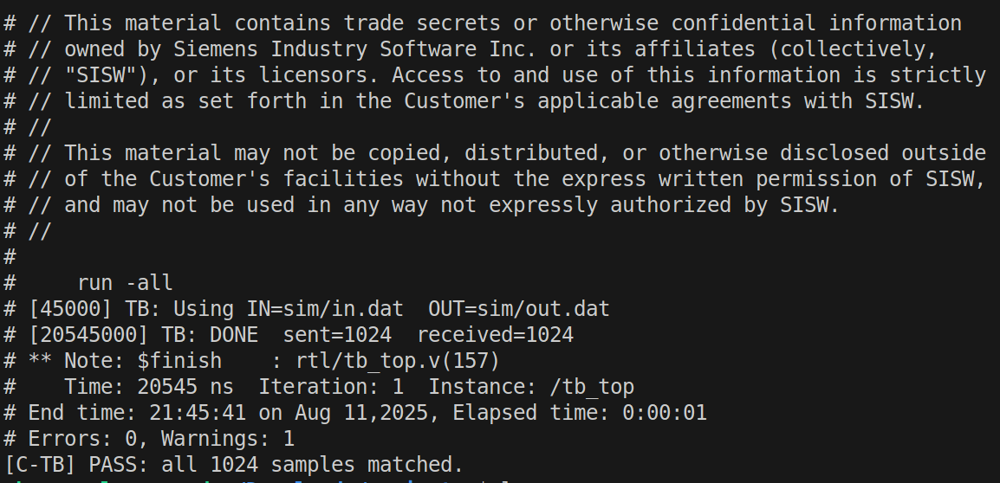

# File-Based C↔RTL Co-Sim Skeleton Framework

This is a tiny, portable framework where a **C testbench** produces input vectors and checks outputs, while a **Verilog DUT** consumes/produces those via simple `.dat` files. The simulator is launched from C in **batch mode** (Questa/ModelSim).

## Flow

1. `sw/main.c` writes `sim/in.dat` (decimal, one integer per line).
2. C spawns `vsim -do sim/run.do` (or ModelSim equivalent).
3. Verilog DUT reads `sim/in.dat`, processes one sample per clock, writes `sim/out.dat`.
4. C blocks until the simulator exits, then reads `sim/out.dat` and compares against golden results.

## Requirements

- Linux/macOS (Windows works too; adjust `VSIM_CMD` if needed)
- QuestaSim or ModelSim on PATH (`vsim` available)
- GCC or Clang

## Control & Data Flow

The following diagram outlines how the C testbench and Verilog DUT interact through co-simulation:

```text
[C Testbench] 
     |
     | 1. Write inputs to `sim/in.dat`
     v
[Input File: sim/in.dat]
     |
     | 2. Launch ModelSim/QuestaSim via `system("vsim ...")`
     v
[HDL Simulator]
     |
     | 3. Verilog DUT reads inputs from `sim/in.dat`
     | 4. DUT computes outputs cycle by cycle
     v
[Output File: sim/out.dat]
     |
     | 5. Simulator exits (via $finish)
     v
[C Testbench]
     |
     | 6. Read `sim/out.dat` and compare with golden output
     v
[Pass / Fail Summary]
```

## Quick Start

To perform the simulation, run the following command:

```bash
make run
```

The simulation output should match the screenshot shown below:


