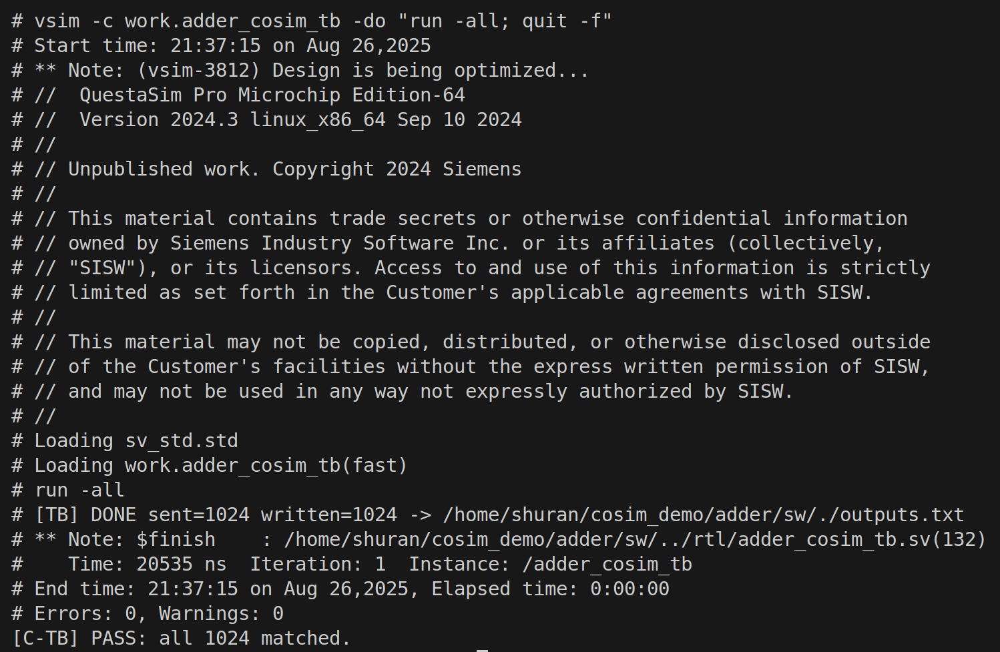

# File‑based Co‑Simulation: `simple_adder_rv` (Ready/Valid)

This repo demonstrates a **portable file‑based co‑simulation (CoSim)** flow to verify a SystemVerilog ready/valid adder (`simple_adder_rv`) using a C++ host and a lightweight SV testbench.  
All commands below use the provided **Makefile**.

---

## Quickstart (Makefile)

```bash
# Build & run the whole co-sim (host + vlog/vsim + compare)
make run

# Optional helpers
make help     # list targets/knobs (if implemented)
make vars     # show key variables
make clean    # remove artifacts
```

On success you'll see a final line like:
```
[C-TB] PASS: all 1024 matched.
```

---

## Example Run (screenshot)

The screenshot below shows a successful batch co‑sim triggered by `make run` on Questa/ModelSim.  
The testbench reports it wrote 1024 outputs and the host prints the PASS summary.



---

## Project Layout

```
rtl/adder_rv_simple.sv   # DUT: ready/valid adder
rtl/adder_cosim_tb.sv    # SV file-based TB (reads inputs.txt, writes outputs.txt)
sw/cosim_tb.cpp         # C++ host: generates vectors, spawns vlog/vsim, checks results
sw/Makefile             # one-command entrypoint for build/run/clean
README.md            # this file
```

---

## DUT Architecture Diagram

A 32‑bit ready/valid adder with simple elastic buffering. Inputs are accepted when
`in_valid && in_ready`, the sum is produced with `out_valid`, and back‑pressure
is honored via `out_ready`.

```
          in_valid,in_a,in_b                       out_valid,out_sum
  ┌───────────────┐      ┌──────────────────────────────┐      ┌──────────────┐
  │   Producer    ├─────►│   simple_adder_rv (DUT)      ├─────►│   Consumer   │
  └──────┬────────┘      │  (2-entry elastic buffering) │      └──────┬───────┘
         │ in_ready      └───────────┬──────────────────┘             │ out_ready
         ▼                           │ (a + b when handshake)         ▼
  (held until ready)                 │                        (always 1 in TB)
```

**Interface (W=32 by default):**
- Inputs: `clk`, `rst_n`, `in_valid`, `in_a[31:0]`, `in_b[31:0]`, `out_ready`
- Outputs: `in_ready`, `out_valid`, `out_sum[31:0]`

---

## CoSim End-to-End Flow

```
             ┌──────────────────────────┐
             │  C++ Host (cosim_tb.cpp) │
             └────────────┬─────────────┘
                         1│  Generate N pairs (hex) → write inputs.txt
                          ▼
                    ┌───────────┐   2│  vlog RTL + TB
                    │  vlog     │    │
                    └─────┬─────┘    │
                          │         3│  vsim -c … -do "run -all; quit -f"
                          ▼          │
                    ┌───────────┐    │  TB reads inputs.txt, drives DUT,
                    │  vsim     │────┘  writes outputs.txt
                    └─────┬─────┘
                          ▼
             ┌──────────────────────────┐
             │  C++ Host: compare a+b   │  → print PASS/FAIL
             └──────────────────────────┘
```

---

## Build & Run Details

### Prerequisites
- **C/C++ toolchain** (e.g., `g++`).
- **Questa/ModelSim** in `PATH` (for `vlog` and `vsim`).

### Makefile workflow
- **`make run`** — Compile RTL+TB, launch simulation, read `outputs.txt`, and compare.
- **`make all`** — Alias for the full flow (same as `run`).
- **`make help`**, **`make vars`** — Inspect available targets and variable values (if implemented).
- **`make clean`** — Remove build/sim artifacts.

Tip: If you want to mimic the exact tool invocations, open the `Makefile` and copy the shown commands.

---

## File Formats

**`inputs.txt`** — two 32‑bit hex numbers per line (space‑separated), e.g.:
```
00000001 00000002
FFFFFFFF 00000001
12345678 9ABCDEF0
```

**`outputs.txt`** — one 32‑bit hex sum per line (`%08h`), with 32‑bit wrap‑around, e.g.:
```
00000003
00000000
AE024568
```

---

## Ready/Valid in the Testbench

- Source holds `(in_valid, in_a, in_b)` until `in_ready` is seen on a clock edge.
- Sink sets `out_ready=1` to allow max throughput and dumps `%08h` when `out_valid && out_ready`.
- Reset asserted for a few cycles before driving any transaction.

---

## Common Issues

- **Simulator not found** — Ensure the Questa/ModelSim bin directory is on your `PATH`.
- **Path confusion** — Prefer absolute paths if you run the tools manually; the Makefile already does the right thing.
- **Windows** — Use the simulator’s shell or WSL so that `vsim -c` works as expected.

---

## License

MIT.

---

## Acknowledgements

Built as a clean, CI‑friendly SW/HW unit‑testing harness using plain text I/O and batch simulator runs.
